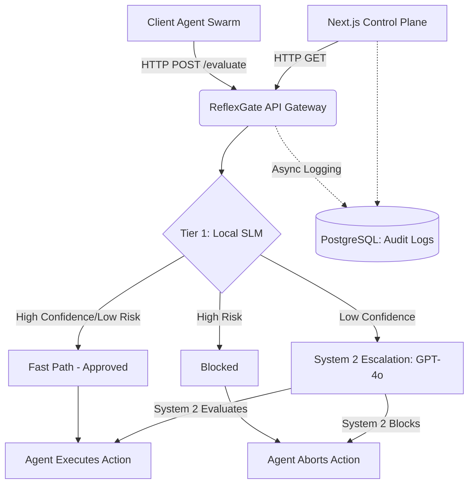

# High-Level Design (HLD): ReflexGate AI Enterprise

## 1. System Architecture Overview
ReflexGate is positioned as an **Enterprise API Gateway & Safety Middleware** specifically engineered for Autonomous AI Agent Swarms. It sits seamlessly between the Agent Execution Framework (e.g., LangChain, AutoGen, CrewAI) and the production environments they interact with.

## 2. Core Components
- **Ingress Gateway (FastAPI):** High-throughput, stateless API server managed by Uvicorn. Scalable horizontally behind load balancers (AWS ALB, Nginx).
- **Tier 1 Evaluator (Small Language Model / SLM):** A locally hosted, fine-tuned SLM (e.g., Llama-3-8B-Instruct or an ONNX-optimized DeBERTa classifier) optimized strictly for intent classification and prompt injection detection (sub-50ms latency).
- **Tier 2 Evaluator (System 2):** Fallback mechanism utilizing frontier LLMs (OpenAI GPT-4o, Anthropic Claude 3.5 Sonnet) to resolve ambiguous or highly complex agent intents.
- **Persistence Layer (PostgreSQL):** Asynchronous telemetry storage using `asyncpg` and SQLAlchemy 2.0. Optimized for write-heavy workloads with partitioned tables.
- **Control Plane (Next.js):** Real-time monitoring, RBAC (Role-Based Access Control), and threshold calibration dashboard.

## 3. Scalability & Fault Tolerance
- **Stateless Gateway:** The FastAPI application maintains no local state. Can be scaled infinitely using Kubernetes Horizontal Pod Autoscalers (HPA).
- **Fire-and-Forget Telemetry:** Database logging is dispatched to the asyncio event loop. If the database experiences a spike or drops connections, the core evaluation loop (Fast Path) is unaffected, preventing bottlenecking.
- **Circuit Breakers:** If the Tier 2 API (OpenAI) experiences an outage or rate-limits, ReflexGate defaults to a conservative fallback posture (e.g., Block or Human Review), ensuring the system fails securely.
